# MCIFT Mechanics Reference v0.13/v0.14

**Status:** speculative toy-model mechanics reference; not established physics  
**Scope:** summarizes the mechanics used so far in this repository through v0.14  
**Visuals:** generated with `mechanics/plot_mechanics.py` using Matplotlib

---

## Visual index

Each mechanic now has a direct graph or diagram in this file.

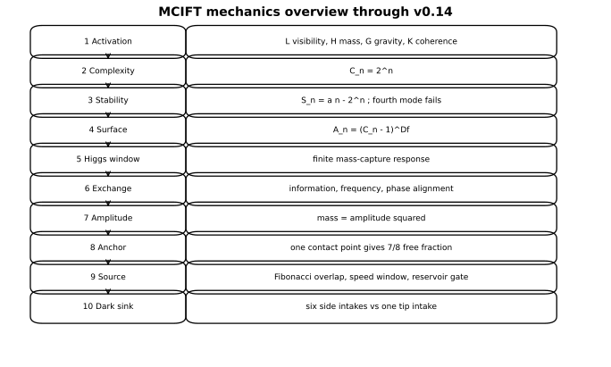

| Mechanic | Figure |
|---|---|
| Channel-specific activation | `figures/activation_channels.svg` |
| Light-channel gate | `figures/light_activation_gate.svg` |
| Complexity growth | `figures/complexity_growth.svg` |
| Stability modes | `figures/stability_modes.svg` |
| Fractal catching surface | `figures/fractal_surface.svg` |
| Finite Higgs-response window | `figures/higgs_response_window.svg` |
| Exchange alignment | `figures/exchange_alignment.svg` |
| Exchange densification | `figures/exchange_densification.svg` |
| Amplitude-first mass | `figures/amplitude_mass.svg` |
| Shadow amplitude correction | `figures/shadow_correction.svg` |
| One-point anchor contacts | `figures/anchor_contacts.svg` |
| Spin-vortex free fraction | `figures/spin_vortex_fraction.svg` |
| Fibonacci-Higgs resonance | `figures/fibonacci_resonance.svg` |
| Funnel-speed capture window | `figures/capture_window.svg` |
| Bounded reservoir gate | `figures/reservoir_gate.svg` |
| Field-source pipeline | `figures/field_source_pipeline.svg` |
| Source-term comparison | `figures/source_terms_bar.svg` |
| Motion by directional exchange | `figures/motion_exchange.svg` |
| Shared-channel geometry | `figures/entanglement_shared_channel.svg` |
| High-complexity confinement proxy | `figures/confinement_complexity.svg` |
| Eight-sector side-sink geometry | `figures/eight_sector_sink_geometry.svg` |
| Dark-visible ratio comparison | `figures/dark_visible_ratio.svg` |
| CERN two-drill event proxy | `figures/cern_event_proxy.svg` |

---

## 0. Status and notation

MCIFT is a speculative toy framework. The mechanics below are internal model rules, not established physics.

The core field is:

$$
\Psi(x,y,z,t,c)
$$

where `x,y,z` are spatial coordinates, `t` is time, and `c` is an internal channel coordinate.

---

## 1. Channel-specific activation

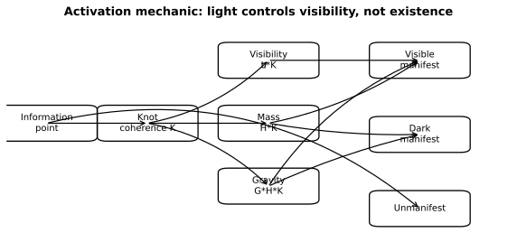

v0.12 corrected the old shorthand around light activation.

Use:

```text
light activation = electromagnetic / visibility-channel activation
```

Do not use:

```text
light activation = existence itself
```

Channel factors:

$$
L_i=\text{light / electromagnetic visibility activation}
$$

$$
H_i=\text{Higgs / mass-capture activation}
$$

$$
G_i=\text{gravitational projection}
$$

$$
K_i=\text{knot coherence}
$$

Resulting channel projections:

$$
\mathrm{Visibility}_i=L_iK_i
$$

$$
\mathrm{Mass}_i=H_iK_i
$$

$$
\mathrm{Gravity}_i=G_iH_iK_i
$$

Matter-state terminology:

```text
unmanifest        no stable visible, mass, or gravitational projection
visible-manifest  light-active, mass-active, gravity-active, knot-coherent
dark-manifest     mass-active and gravity-active, but light-inactive
```

Dark-manifest condition:

$$
L_i\approx0,\quad H_i>0,\quad G_i>0,\quad K_i>0.
$$

---

## 1.1 Light-channel gate

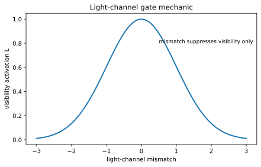

The light channel is a visibility gate. A mismatch suppresses electromagnetic visibility without automatically removing mass or gravitational projection.

Compact rule:

$$
L_i=0\Rightarrow \mathrm{Visibility}_i=0
$$

not:

$$
L_i=0\Rightarrow \mathrm{Mass}_i=0.
$$

---

## 2. Cluster complexity

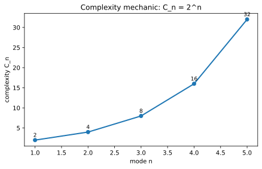

Mode complexity is modeled by binary growth:

$$
C_n=2^n.
$$

So:

$$
C_1=2,\quad C_2=4,\quad C_3=8,\quad C_4=16.
$$

The eight-sector knot used in the tau-like and dark-manifest tests is:

$$
C_3=8.
$$

---

## 3. Stability and the failed fourth mode

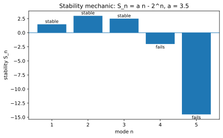

A simple coherence law is:

$$
Q_n=an.
$$

Original stability:

$$
S_n=an-2^n.
$$

A cluster survives if:

$$
S_n>0.
$$

The fourth mode fails if:

$$
S_4<0.
$$

For exactly three stable modes and a failed fourth mode:

$$
\frac{8}{3}<a<4.
$$

The central toy value used repeatedly is:

$$
a=3.5.
$$

Then the fourth mode is treated as a failed sector that can supply bounded reservoir availability rather than as a fourth stable particle.

---

## 4. Fractal catching surface

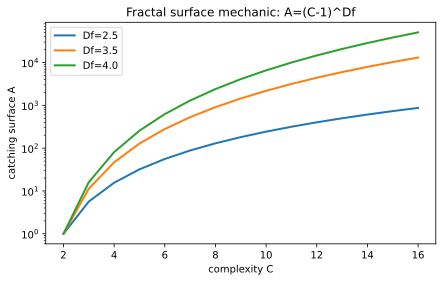

The mass-catching surface is:

$$
A_n=(C_n-1)^{D_f}.
$$

The default toy exponent is:

$$
D_f=3.5+\epsilon.
$$

Interpretation:

```text
cluster complexity creates surface structure;
surface structure controls how much response can be caught.
```

---

## 5. Finite Higgs-response window

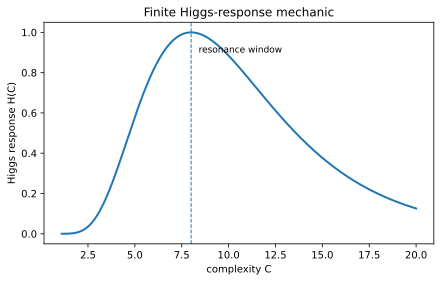

The finite Higgs-response channel can be modeled as:

$$
H(C_n)=\exp\left[-\frac{(\ln C_n-\ln C_*)^2}{2w^2}\right].
$$

The Higgs channel is separated from the light channel:

```text
Higgs/mass capture can be active even when light/visibility is suppressed.
```

This distinction permits the dark-manifest category.

---

## 6. Vibration and exchange

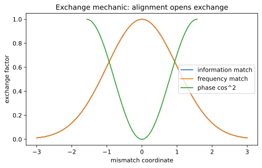

Internal vibration opens exchange between similar information points.

Pairwise exchange:

$$
\Gamma_{ij}
=
g
\exp\left[-\frac{(I_i-I_j)^2}{2\sigma_I^2}\right]
\exp\left[-\frac{(\omega_i-\omega_j)^2}{2\sigma_\omega^2}\right]
\cos^2(\phi_i-\phi_j).
$$

Exchange is strongest when information, frequency, and phase align.

Whole-knot exchange:

$$
\Gamma_n=\frac{1}{C_n}\sum_{i<j}\Gamma_{ij}.
$$

---

## 6.1 Exchange densification

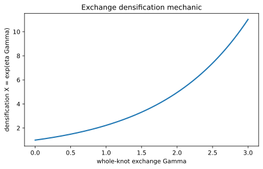

Exchange/densification factor:

$$
X_n=e^{\eta\Gamma_n}.
$$

Exchange-updated stability:

$$
S_n=3.5nX_n-C_n.
$$

Exchange-updated rest mass:

$$
m_{0,n}=m_{scale}(C_n-1)^{D_f}X_nH(C_n)\max(S_n,0).
$$

---

## 7. Amplitude-first mass

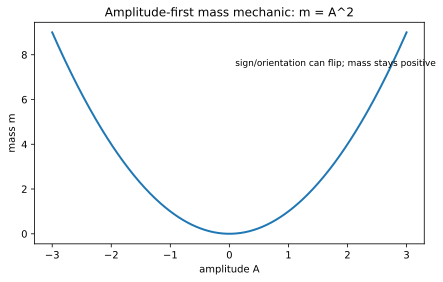

The model treats mass as squared amplitude:

$$
m_n=A_n^2.
$$

A visible cluster has information pattern:

$$
I_n
$$

and a complementary/shadow pattern:

$$
I_n^s.
$$

Mass amplitude is:

$$
A_n=I_n-I_n^s.
$$

If a base model gives:

$$
m_n^{base},
$$

then:

$$
A_n^{base}=\sqrt{m_n^{base}}.
$$

An amplitude correction:

$$
\Delta_n
$$

produces:

$$
m_n=m_n^{base}\Delta_n^2.
$$

---

## 8. Shadow projection and Koide-style clue

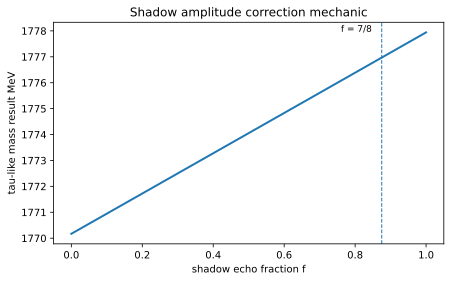

For the tau-like third mode:

$$
C_3=8.
$$

Primary shadow term:

$$
s_1=\frac{1}{C_3(C_3-1)}=\frac{1}{56}.
$$

Echo-shadow term:

$$
s_2=\frac{s_1}{C_3}=\frac{1}{448}.
$$

Amplitude correction:

$$
\Delta(f)=1+s_1+fs_2.
$$

Mass prediction:

$$
m_\tau(f)=m_\tau^{base}\Delta(f)^2.
$$

The `7/8` projection gave the earlier near-Koide tau-like result.

---

## 9. One-point shadow anchor

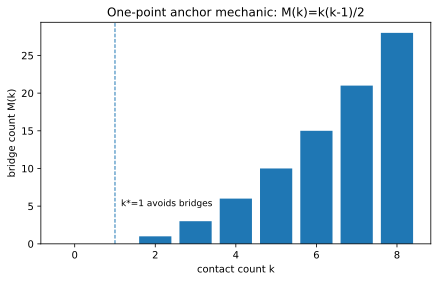

Let `K_8` be the original eight-sector knot and `S_8` its shadow.

Contact count:

$$
k=|K_8\cap S_8|.
$$

A true shadow must connect:

$$
k\ge1.
$$

Multiple contact points create bridges:

$$
M(k)=\frac{k(k-1)}{2}.
$$

A stable shadow must avoid merger motion, so:

$$
M(k)=0.
$$

Together:

$$
k_*=1.
$$

---

## 10. Spin-vortex interpretation

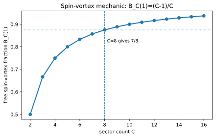

For a `C`-sector knot, one pinned anchor leaves:

$$
B_C(1)=\frac{C-1}{C}.
$$

For `C=8`:

$$
B_8(1)=\frac{7}{8}.
$$

Interpretation:

```text
one pinned sector
-> remaining sectors circulate freely
-> free circulation fraction B_C(1)
-> spin-vortex correction
```

---

## 11. Fibonacci-Higgs anchor-tip source

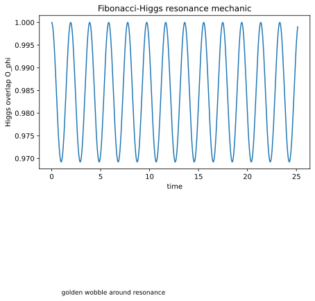

The Fibonacci/golden structure shapes the anchor-tip oscillation around the Higgs-response resonance.

Golden ratio:

$$
\varphi=\frac{1+\sqrt5}{2}.
$$

Minimal wobble:

$$
\omega_\varphi(t)=\omega_H+\Delta\omega\sin(\varphi t).
$$

Higgs overlap:

$$
O_{\varphi,a}(t)
=
\exp\left[-\frac{(\omega_{\varphi,a}(t)-\omega_H)^2}{2\sigma_\omega^2}\right]
\cos^2(\theta_{\varphi,a}(t)-\theta_H)
\exp\left[-\frac{d_{c,H,a}^{2}}{2\sigma_c^2}\right].
$$

Reduced tau-like overlap:

$$
\langle O_\varphi\rangle=0.9837806705.
$$

---

## 12. Funnel-speed capture window

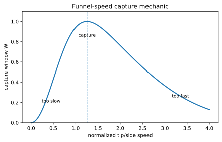

The speed window is:

$$
W_v(v)
=
\frac{
\left(1-e^{-(v/v_{min})^2}\right)
e^{-(v/v_{scatter})^2}
}{W_{max}}.
$$

Interpretation:

```text
too slow  -> no channel connection
just right -> capture
too fast  -> scattering or non-retention
```

This speed condition multiplies the source term.

---

## 13. Bounded fourth-mode reservoir

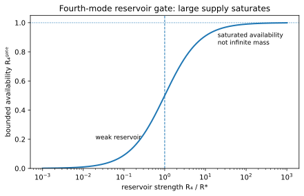

The failed fourth-mode sector can be treated as a large available supply, but not as an unlimited mass multiplier.

Bounded gate:

$$
R_4^{gate}=\frac{R_4}{R_4+R_*}.
$$

Limits:

$$
R_4\ll R_*\Rightarrow R_4^{gate}\approx0
$$

$$
R_4\gg R_*\Rightarrow R_4^{gate}\approx1
$$

Interpretation:

```text
reservoir = available supply
gate = bounded availability
funnel aperture = captured fraction
```

---

## 14. Current visible field-source equation

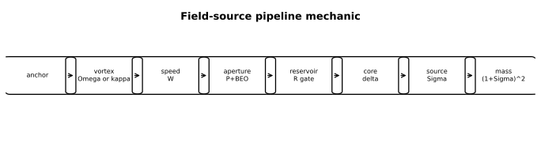

Let:

$$
\mathcal{D}=\partial_t^2-c_*^2\nabla^2-D_c\partial_c^2+V'(\psi).
$$

Then:

$$
\mathcal{D}\psi=\sum_a S_{tip,a}.
$$

Visible/tip source:

$$
S_{tip,a}
=
\lambda_a
\Omega_{OS,a}
W_v(v_{tip,a})
\left[
P_{C_a}+B_{C_a}(1)E_{C_a}\langle O_{\varphi,a}\rangle
\right]
R_{4,a}^{gate}
\delta_{\epsilon,a}^{(\varphi)}.
$$

For the tau-like eight-sector case:

$$
P_8=\frac{1}{56},\quad E_8=\frac{1}{448},\quad B_8(1)=\frac{7}{8}.
$$

---

## 14.1 Source-term comparison

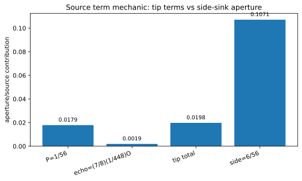

Integrated source:

$$
\Sigma_\tau
=
W_v
\left[
\frac{1}{56}
+
\frac{7}{8}\frac{1}{448}\langle O_\varphi\rangle
\right]
R_4^{gate}.
$$

Mass rule:

$$
m_\tau=m_\tau^{base}(1+\Sigma_\tau)^2.
$$

At `W_v=1`, `R_4^gate=1`, and `⟨Oφ⟩=0.9837806705`, the reduced tau-like result is:

$$
m_\tau=1776.86\ \mathrm{MeV}.
$$

---

## 15. Motion by directional exchange

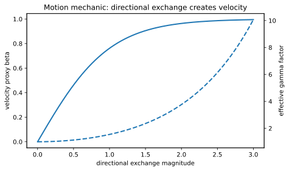

Rest-mass formation and motion are separated:

```text
balanced internal exchange -> rest mass / densification
directional exchange -> velocity
velocity -> total effective energy increase
```

A compact motion factor:

$$
m_{eff,n}=\gamma_nm_{0,n}.
$$

with:

$$
\beta_n=\tanh(\eta|\vec{\Gamma}_n|)
$$

and:

$$
\gamma_n=\cosh(\eta|\vec{\Gamma}_n|).
$$

---

## 16. Entanglement and shared-channel geometry

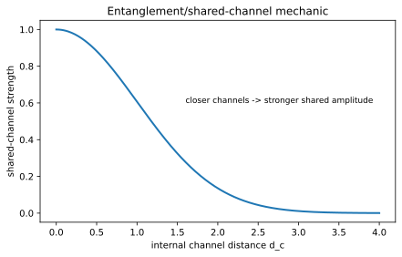

Entanglement is modeled as shared amplitude through channel adjacency, not as controllable messaging.

A compact shared-amplitude mass-defect form:

$$
m_{AB}=m_A+m_B-2\epsilon\mathcal{E}_{AB}\sqrt{m_A m_B}.
$$

Shared-channel strength:

$$
\mathcal{E}_{AB}
=
\lambda_{AB}
O_{AB}
\exp\left[-\frac{d_c^2}{2\sigma_c^2}\right]
\tanh\left(\frac{\Gamma_{AB}}{\Gamma_c}\right).
$$

Important caveat:

```text
shared channel -> correlation
shared channel != controllable nonlocal messaging
```

---

## 17. Black-hole / confinement interpretation

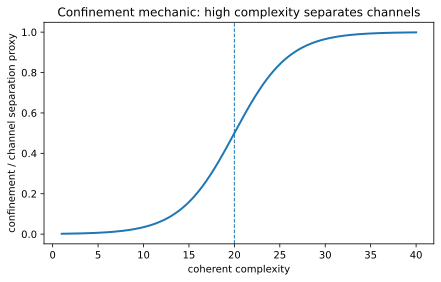

Extreme coherent complexity may create internally separated channels.

The repository has used this as a speculative confinement mechanic:

```text
large coherent complexity
-> strong internal channel separation
-> trapped or confined information pathways
```

This remains underdeveloped and is not yet part of the v0.13 source tests.

---

## 18. v0.13 dark-manifest six-side sink

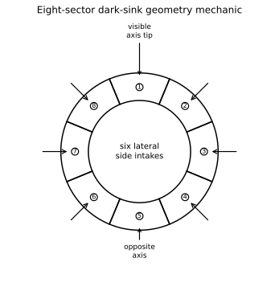

The dark-manifest idea in v0.13 is not simply an opposite sign. It is an inverse geometry.

Visible-manifest matter:

```text
one axial tip intake
```

Dark-manifest matter:

```text
six lateral side intakes
```

Eight-sector split:

```text
1 sector  = visible axial tip
1 sector  = opposite axis
6 sectors = lateral side-intake belt
```

Visible aperture:

$$
A_{tip}
=
\frac{1}{56}
+
\frac{7}{8}\frac{1}{448}\langle O_\varphi\rangle.
$$

Dark side aperture:

$$
A_{side}=6\left(\frac{1}{56}\right).
$$

---

## 18.1 Dark-visible ratio

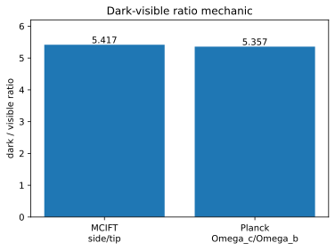

Using:

$$
\langle O_\varphi\rangle=0.9837806705,
$$

gives:

$$
A_{tip}=0.01977858948
$$

$$
A_{side}=0.1071428571
$$

$$
\frac{A_{side}}{A_{tip}}=5.417.
$$

Planck 2018 comparison values used in this toy check:

$$
\Omega_c h^2\approx0.120,\quad \Omega_b h^2\approx0.0224.
$$

So:

$$
\frac{\Omega_c}{\Omega_b}\approx5.357.
$$

The reduced v0.13 ratio is within about `1.1%` of the comparison value.

Side-efficiency factor needed to match the central value:

$$
\epsilon_{sink}\approx0.989.
$$

---

## 19. Dark-manifest source form

Visible source:

$$
S_{visible}
=
\lambda_+
\Omega_z
W_{tip}
A_{tip}
R_4^{gate}
\delta_{tip}^{(\varphi)}.
$$

Dark source:

$$
S_{dark}
=
-
\lambda_-
\kappa_{sink}
W_{side}
A_{side}
R_4^{gate}
\delta_{side}^{(\varphi)}.
$$

where:

$$
\kappa_{sink}=-\nabla_\perp\cdot J_\perp.
$$

The negative sign means inverse field orientation, not negative mass.

Mass density uses magnitude:

$$
\rho_{dark}\propto |S_{dark}|.
$$

Light visibility is suppressed:

$$
L_{dark}\approx0.
$$

---

## 19.1 CERN two-drill event proxy

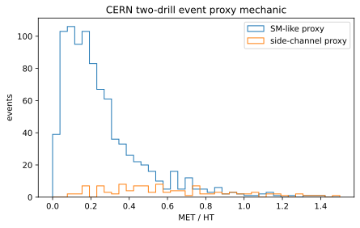

v0.14 maps the two-drill collision picture to collider observables.

```text
visible drill activity -> jets and visible transverse energy
dark side channel -> missing transverse momentum and event imbalance
```

Main proxy:

$$
R_{miss}=\frac{E_T^{miss}}{H_T}.
$$

Current verdict:

```text
not confirmed, not ruled out by the reduced comparison, now constrained
```

---

## 20. Open derivation targets

1. Derive the field operator from an action.
2. Derive the finite Fibonacci-shaped source core.
3. Derive `lambda_a Omega_OS,a` from original/shadow vortex geometry.
4. Derive the capture-window parameters from knot dynamics.
5. Derive `R_*` and `R_4` from the failed fourth-mode sector.
6. Derive the six-side split from explicit eight-sector knot/shadow geometry.
7. Derive the side-flow convergence term `kappa_sink`.
8. Test whether dark-manifest knots reproduce galaxy-scale gravitational behavior.
9. Check Lorentz and gauge compatibility.
10. Identify falsifiable predictions or reject the mechanism.

---

## Reproducing the figures

Run:

```bash
python mechanics/plot_mechanics.py
```

The script writes SVG diagrams to:

```text
mechanics/figures/
```

The GitHub Actions workflow also runs the script and commits changed SVG outputs back into the repository.
