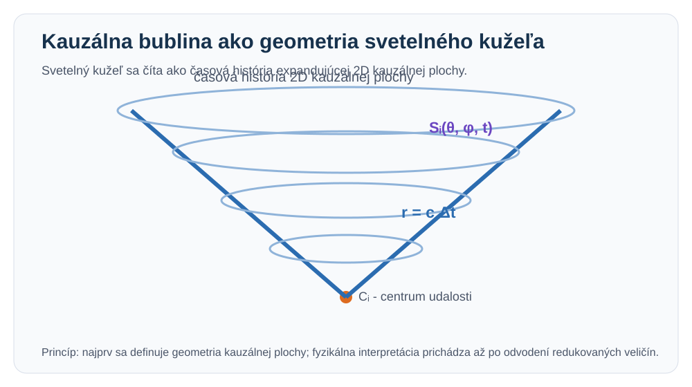
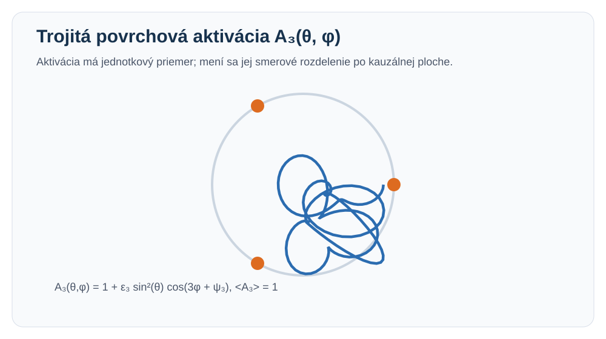
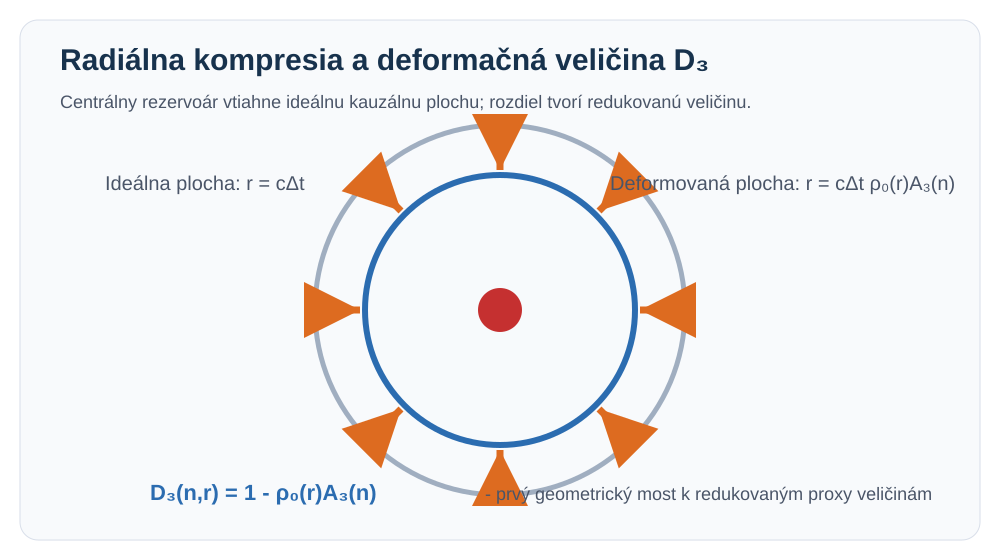

# Geometrický redukčný rámec MCIFT

**Základné princípy a východisková matematická konštrukcia pre FEI/STU**  
**Pracovná verzia:** v0.1  
**Jazyk:** slovenčina  
**Stav:** špekulatívny výskumno-teoretický rámec a geometrický redukčný scaffold

> Tento dokument nepredstavuje etablovanú fyzikálnu teóriu. MCIFT v tejto fáze nenahrádza kvantovú teóriu poľa, všeobecnú relativitu, Štandardný model časticovej fyziky ani štandardný kozmologický model. Cieľom je pripraviť matematicky čitateľný prehľad geometrickej konštrukcie a jej redukovaných veličín pre akademickú diskusiu.

---

## 1. Abstrakt a stav dokumentu

Tento dokument predstavuje úvodný teoretický prehľad rámca **MCIFT** - *Multi-Channel Information Field Theory*, teda Teórie viac-kanálového informačného poľa. Cieľom textu je sformulovať základné princípy rámca v akademicky čitateľnej forme a pripraviť pôdu pre následné kozmologické a kolíderové výpočty.

Rámec MCIFT je v tejto fáze chápaný ako špekulatívny výskumno-teoretický model a geometrický redukčný scaffold. Jeho aktuálnym cieľom je preveriť, či možno z jednej geometricky definovanej konštrukcie odvodiť stabilné redukované veličiny, ktoré sa dajú transparentne mapovať na vybrané fyzikálne proxy oblasti.

Základná myšlienka dokumentu je nasledovná: najprv sa definuje geometrický objekt, potom sa z neho odvodia redukované veličiny a až následne sa tieto veličiny používajú v kozmologických a kolíderových výpočtoch.

```text
geometria -> redukované veličiny -> mapovacie pravidlá -> porovnanie s fyzikálnymi proxy dátami
```

Tento dokument pokrýva prvé štyri časti pripravovaného prehľadu:

```text
1. Abstrakt a stav dokumentu
2. Motivácia
3. Základné princípy
4. Geometrický objekt
```

Neskoršie časti majú doplniť matematický reduktor, kozmologickú mechaniku výpočtu, kolíderovú mechaniku výpočtu, validačnú maticu, limity a falzifikovateľné testy.

---

## 2. Motivácia

Moderná fyzika používa viacero veľmi úspešných teoretických opisov, ktoré pracujú s rozdielnymi matematickými jazykmi a fyzikálnymi intuíciami. Kvantová teória poľa popisuje časticové a poľové procesy, všeobecná relativita popisuje gravitáciu ako geometriu priestoročasu a kozmologické modely používajú efektívne veličiny na opis veľkoškálového vývoja vesmíru.

Rámec MCIFT nevychádza z tvrdenia, že tieto etablované teórie sú nesprávne. Vychádza zo slabšieho a testovateľnejšieho cieľa: preskúmať, či existuje geometrická redukčná konštrukcia, ktorá dokáže z jedného spoločného objektu vytvoriť malé množstvo vnútorných veličín použiteľných v rôznych fyzikálnych proxy doménach.

Motivácia teda nie je okamžite formulovať novú úplnú fyzikálnu teóriu. Motivácia je vytvoriť medzivrstvu:

```text
geometrický objekt
-> vnútorné redukované veličiny
-> označené mapovania na fyzikálne proxy veličiny
-> kontrola zhody, zlyhania a citlivosti
```

Takýto prístup má tri výhody.

Po prvé, núti oddeliť matematickú konštrukciu od fyzikálnej interpretácie. To je dôležité preto, aby sa geometrický model neprezentoval ako experimentálne potvrdená teória skôr, než sa preukáže jeho stabilita, reprodukovateľnosť a schopnosť prežiť nezávislé testy.

Po druhé, umožňuje jasne označiť každú veličinu podľa jej pôvodu. Niektoré veličiny môžu byť odvodené z geometrie, iné môžu byť predpokladané parametre, ďalšie môžu byť fitované kotviace body a niektoré časti môžu zostať netestované. Takéto označenie je nevyhnutné pre serióznu akademickú diskusiu.

Po tretie, spoločný reduktor umožňuje porovnávať rôzne domény bez toho, aby sa pre každú doménu zavádzala úplne nová nezávislá sada pravidiel. Ak rovnaké redukované veličiny vstupujú do kozmologického aj kolíderového mapovania, vzniká silnejšia požiadavka na vnútornú konzistenciu rámca.

Základná výskumná otázka preto znie:

```text
Možno z jednej geometricky definovanej konštrukcie odvodiť stabilné redukované veličiny, ktoré sa dajú konzistentne mapovať na vybrané kozmologické a kolíderové proxy výpočty?
```

Táto otázka je zámerne formulovaná opatrne. Nehovorí, že rámec MCIFT už potvrdzuje novú fyziku. Hovorí iba to, že existuje matematicko-geometrická konštrukcia, ktorú možno analyzovať, testovať, porovnávať a prípadne vyvrátiť.

---

## 3. Základné princípy

Rámec MCIFT sa v tejto verzii opiera o niekoľko základných princípov. Tieto princípy nie sú prezentované ako definitívne fyzikálne zákony. Sú to pracovné postuláty, z ktorých sa následne buduje geometrická redukčná konštrukcia.

### Princíp 1: udalosť a kauzálna plocha

Základným stavebným prvkom nie je najprv častica ani klasické pole, ale udalosť s kauzálnou plochou. Lokálny objekt sa chápe ako centrum udalosti, z ktorého sa rozvíja dvojrozmerná kauzálna plocha. Táto plocha reprezentuje hranicu možného kauzálneho dosahu vzhľadom na lokálny časový vývoj.

Základná intuícia je:

```text
centrum udalosti + rozširujúca sa kauzálna plocha + radiálna vzdialenosť
```

V plochom prípade je radiálna vzdialenosť určená svetelnou rýchlosťou:

```text
r = c Δt
```

Tým sa svetelný kužeľ interpretuje ako časová história expandujúcej dvojrozmernej kauzálnej bubliny.



**Obr. 1:** Svetelný kužeľ ako časová história expandujúcej dvojrozmernej kauzálnej bubliny.

### Princíp 2: geometria pred interpretáciou

Fyzikálna interpretácia má nasledovať až po geometrickej konštrukcii. Najprv sa musí definovať geometrický objekt, potom jeho deformácie, integrály a redukované veličiny. Až následne možno skúmať, či tieto veličiny majú zmysluplné mapovanie na hmotnosť, šmyk, expanziu, šírku rozpadu alebo kolíderové korelácie.

Základné poradie je:

```text
geometrický objekt -> deformácia -> redukované proxy veličiny -> fyzikálne mapovanie
```

Tento princíp chráni rámec pred tým, aby sa výsledky interpretovali silnejšie, než dovoľuje matematická konštrukcia.

### Princíp 3: deformácia ako zdroj redukovaných veličín

Ak je kauzálna plocha v ideálnom stave, jej radiálna expanzia zodpovedá jednoduchej svetelnej geometrii. Ak je plocha deformovaná, vzniká rozdiel medzi ideálnym a skutočným radiálnym dosahom. Tento rozdiel sa interpretuje ako základná redukovaná informácia o vnútornom stave systému.

V jednoduchom tvare možno deformáciu zapísať ako:

```text
D(n,r) = 1 - ρ(n)
```

kde `ρ(n)` vyjadruje smerovo závislú mieru radiálnej kompresie alebo oslabenia v smere `n`.

V trojitej verzii rámca sa deformácia zapisuje ako:

```text
D₃(n,r) = 1 - ρ₀(r) A₃(n)
```

kde `ρ₀(r)` popisuje radiálnu kompresiu centrálneho zdroja a `A₃(n)` popisuje trojitú povrchovú aktiváciu.

### Princíp 4: zlyhaný štvrtý mód ako centrálny rezervoár

Rámec používa pracovnú stabilitnú schému, v ktorej prvé tri módy prežívajú ako stabilné relačné štruktúry, zatiaľ čo štvrtý mód zlyháva. Tento zlyhaný štvrtý mód sa neinterpretuje ako štvrtá stabilná častica. Namiesto toho sa ukladá ako centrálny rezervoár.

Symbolicky:

```text
módy 1, 2, 3 -> stabilné povrchové slučky
mód 4 -> zlyhaný centrálny rezervoár
```

Tento princíp je dôležitý preto, že neskoršia trojitá geometria nemá byť ľubovoľne zvolená. Vychádza z predstavy, že tri stabilné povrchové kanály sú najmenšou uzavretou relačnou štruktúrou a zlyhaný štvrtý mód ostáva skrytý v strede ako rezervoár.

### Princíp 5: trojitá uzávierka ako minimálna stabilná relácia

Najmenšia uzavretá relačná štruktúra vyžaduje tri členy. Dvojica dokáže vytvoriť rozdiel alebo polaritu, ale ešte nedáva uzavretý obvod porovnania. Trojica umožňuje spätnú väzbu, orientáciu a uzávierku.

Symbolicky:

```text
A -> B -> C -> A
```

Takáto štruktúra je prvým minimálnym uzavretým relačným obvodom. V rámci MCIFT sa preto trojitá slučková štruktúra nepoužíva iba ako geometrická ozdoba, ale ako minimálna forma stabilnej manifestačnej uzávierky.

Tento princíp možno vyjadriť ako:

```text
stabilná manifestácia vyžaduje uzavretú relačnú informáciu
a najmenšia uzavretá relačná štruktúra je trojitá
```


**Obr. 2:** Trojitá relačná uzávierka a centrálny rezervoár zlyhaného štvrtého módu.

---

## 4. Geometrický objekt

Aktuálny geometrický objekt rámca MCIFT vychádza z udalostno-bublinového primitívu. V základnej forme je lokálny objekt zapísaný ako:

```text
B_i = {C_i, S_i, r_i, W_i, Φ_i}
```

kde:

```text
C_i   = centrum udalosti
S_i   = dvojrozmerná kauzálna plocha
r_i   = radiálna vzdialenosť od centra k ploche
W_i   = kauzálne váhy alebo smerové váhovanie
Φ_i   = fázový, časovací a vnútorný stav
```

Tento objekt možno chápať ako lokálnu kauzálnu bublinu. Centrum `C_i` určuje miesto a čas udalosti. Plocha `S_i` predstavuje kauzálnu hranicu. Vzdialenosť `r_i` určuje, ako ďaleko sa kauzálny dosah rozvinul za časový interval `Δt`. Váhy `W_i` umožňujú smerovú deformáciu a vnútorný stav `Φ_i` nesie fázové a štruktúrne informácie.

V plochom prípade platí:

```text
r_i(n,t) = c Δt
```

V deformovanom prípade sa zavádza smerovo závislá radiálna funkcia:

```text
r_i(n,t) = c Δt ρ_i(n)
```

kde `ρ_i(n)` vyjadruje efektívnu kauzálnu silu alebo radiálnu kompresiu v smere `n`.

Trojitá verzia geometrického objektu rozširuje základný objekt o centrálny rezervoár a tri stabilné povrchové slučky:

```text
B_i³ = {C_i, S_i, r_i, W_i, Φ_i, M₀, R₄, L₃}
```

kde:

```text
M₀   = centrálny záťažový alebo hmotnostný seed
R₄   = rezervoár zlyhaného štvrtého módu
L₃   = tri stabilné povrchové slučky
```

Trojitá povrchová aktivácia sa zapisuje v kompaktnom tvare:

```text
A₃(θ,φ) = 1 + ε₃ sin²(θ) cos(3φ + ψ₃)
```

s normalizáciou:

```text
<A₃>_S2 = 1
```

Táto normalizácia znamená, že priemerná povrchová aktivácia zostáva jednotková. Trojitá štruktúra teda nemení celkový priemer aktivácie, ale mení jej rozdelenie po povrchu.



**Obr. 3:** Trojitá povrchová aktivácia s jednotkovým priemerom a smerovým rozdelením po ploche.

Centrálny rezervoár vytvára regulovanú radiálnu kompresiu:

```text
ρ₀(r) = 1 - α_M M₀ / (r² + r_core²)
```

kde `α_M` určuje silu väzby medzi centrálnou záťažou a radiálnou deformáciou, `M₀` je centrálny seed a `r_core` zabraňuje singularite v strede.

Výsledná trojitá radiálna geometria je:

```text
r₀(n,t) = c Δt ρ₀(r) A₃(n)
```

Z tejto rovnice vyplýva, že kauzálna plocha nie je deformovaná iba radiálne, ale aj uhlovo. Centrálna kompresia `ρ₀(r)` určuje základné vtiahnutie povrchu a trojitá aktivácia `A₃(n)` určuje, ako je táto deformácia rozdelená po povrchu.

Základná deformačná veličina je potom:

```text
D₃(n,r) = 1 - ρ₀(r) A₃(n)
```

Táto veličina je prvým mostom medzi geometriou a neskoršími výpočtami. Z nej možno následne vytvárať priemernú záťaž, šmykový proxy člen, amplitúdu trojitej deformácie, rezíduum svetelného kužeľa a ďalšie redukované veličiny.



**Obr. 4:** Ideálna kauzálna plocha, radiálna kompresia a deformačná veličina `D₃`.

Dôležité je, že v tomto bode ešte nejde o tvrdenie experimentálnej zhody. Ide o matematickú konštrukciu, ktorá definuje, čo sa bude v ďalšej časti počítať a ako sa budú redukované veličiny oddeľovať od fyzikálnych interpretácií.

---

## Ďalší krok

Nasledujúca časť pripravovaného paperu má doplniť matematický reduktor:

```text
geometrický objekt B_i³
-> povrchová aktivácia A₃(θ,φ)
-> radiálna kompresia ρ₀(r)
-> deformácia D₃(n,r)
-> povrchové integrály
-> redukované veličiny v0.97
```

Cieľom ďalšej časti bude ukázať, ktoré veličiny sú odvodené z geometrie, ktoré sú normalizácie, ktoré sú predpokladané parametre a ktoré ešte vyžadujú citlivostnú analýzu.
